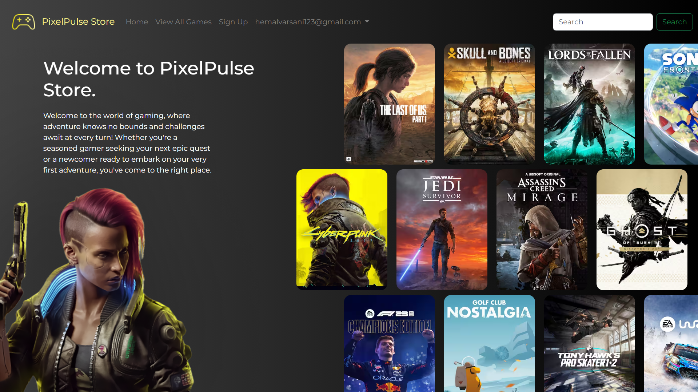
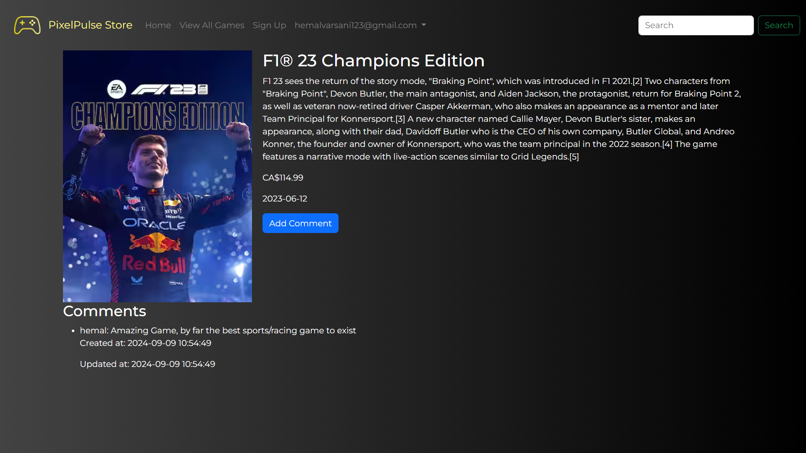
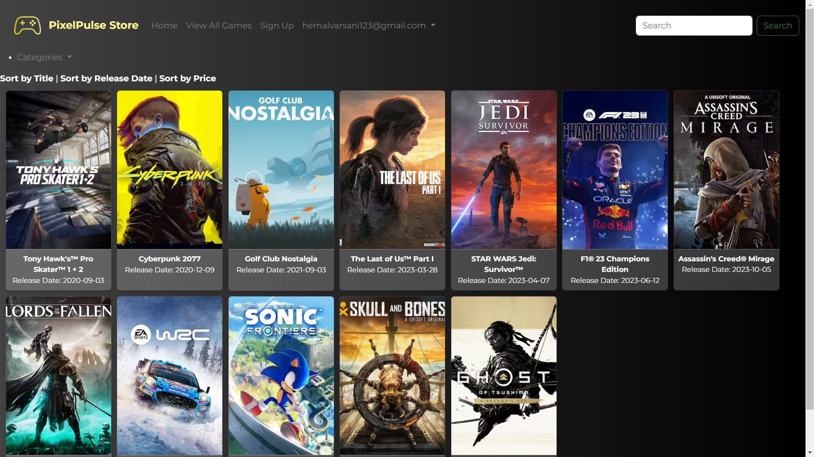
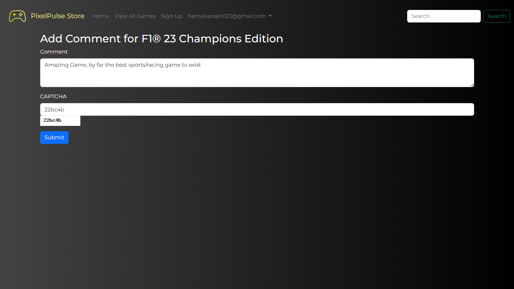
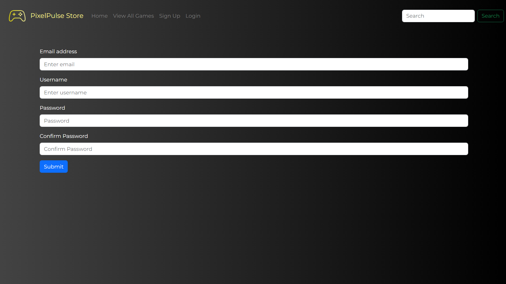

# PixelPulse Store 🎮🕹️

Welcome to **PixelPulse Store**, a content management system (CMS) for buying games online. Built using PHP, this platform provides a streamlined user experience for browsing and purchasing games, with categories for action, sports/racing, and adventure games.

---

## Table of Contents
- [About the Project](#about-the-project)
- [Features](#features)
- [Tech Stack](#tech-stack)
- [Screenshots](#screenshots)
- [Usage](#usage)
- [Future Enhancements](#future-enhancements)
- [License](#license)
- [Contact](#contact)

---

## About the Project
**PixelPulse Store** is a PHP-based online store designed for purchasing video games. The site includes a robust user authentication system for signing up and logging in, and it also features a game review system. Before adding reviews, users must complete a human verification test using CAPTCHA to ensure secure and spam-free comments.

---

## Features
- **User Authentication**: Allows users to create accounts, login, and manage their profiles.
- **Game Browsing**: Games are organized into categories such as Action, Sports/Racing, and Adventure.
- **Search Functionality**: Users can search for games within specific categories to easily find what they are looking for.
- **Sorting Options**: Users can sort games by title, release date, or price to personalize their shopping experience.
- **Game Reviews**: Users can leave comments and reviews on games they have purchased.
- **Human Verification (CAPTCHA)**: Users are required to complete a CAPTCHA challenge to post reviews, ensuring the authenticity of the input.

---

## Tech Stack
- **Backend**: PHP
- **Frontend**: HTML5, CSS3, JavaScript
- **Database**: PHPMyAdmin
- **Human Verification**: custom CAPTCHA
- **Version Control**: Git & GitHub

---

## Screenshots

### Home Page

### Product Page

### Game Categories

### Game Review with CAPTCHA

### User Authentication

---

## Usage

- Visit the homepage to browse games by category.
- Sign up or log in to add comments and reviews for games.
- Complete the CAPTCHA challenge to verify you're human before submitting a review.

---

## Future Enhancements
- Add a payment Features for users to buy games directly from the store.
- Integrate social media sharing for game reviews.

---

## License
Distributed under the MIT License. See `LICENSE` for more information.

---

## Contact
**Hemal Varsani**  
GitHub: [https://github.com/varsanihemal](https://github.com/varsanihemal)

---
